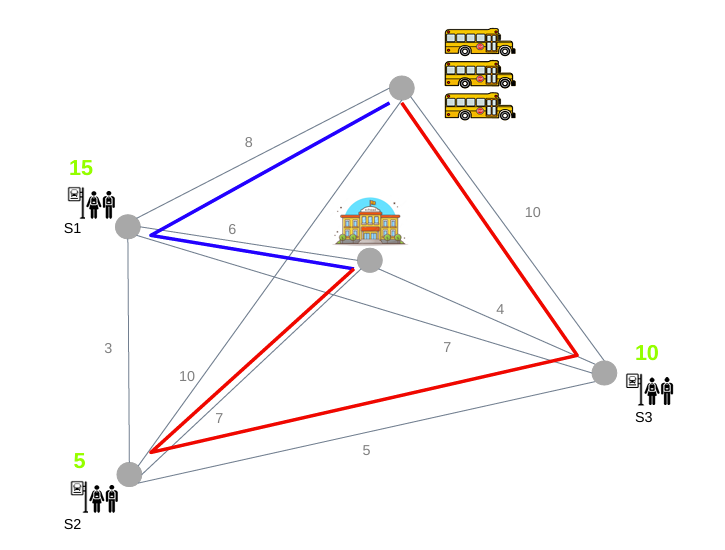
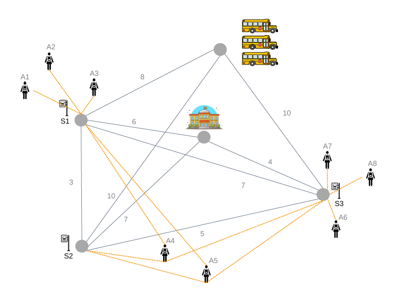

# Optimal Route Assignment

## Description
Developed in 2022, "Optimal Route Assignment" is a university project made during the second course of Computer Engineering at UC3M in collaboration with @AliciaBR02.

It was made for the subject "Heuristics and Optimization" and is the solution to a problem proposed. The main goal of this project was to put in practice our knowledge about **linear programming** and teach us the use of **GLPK MathProg** to solve optimization problems.

## Table of Contents
- [Installation](#installation-linux)
- [Usage](#usage-linux)
- [Problem Proposed  (Part 1)](#problem-proposed-part-1)
- [Problem Proposed  (Part 2)](#problem-proposed-part-2)
- [License](#license)
- [Contact](#contact)

## Installation (Linux)
To be able to execute this code, it is needed to instal GLPK. To do so, use the following command in a terminal:
```sh
sudo apt-get install glpk-utils
```

## Usage (Linux)
To execute the program first get into the folder of the code you want to run. Then, use the following command if you want the result to be displayed on console:
```sh
glpsol --math model.mod --data data.dat
```
Or the following if you want it in a text file:
```sh
glpsol --math model.mod --data data.dat --output output.txt
```

## Problem Proposed (Part 1)
The first problem proposed contains a graph with 9 edges and 5 nodes. Each node can represent 1 of 3 different options: the bus station, the school or a bus stop. Edges represent the roads that take from one node to the other and are labeled with a number representing the distance between both points. Nodes representing bus stops are also labeled with a number that represents the number of people waiting for the bus.

The goal of this exercise is to decide what is the cheapest way to get all the studentes to school using buses comming from the bus station. **It is important to consider the following data:**

- The maximum number of buses that can be used is 3. Each bus used has a fixed cost of 120€ and a capacity of 20 students.

- The cost of travelling 1 kilometer is 5€.

- There can't be more than 1 bus arriving to the same bus stop.

An axample of a possible solution is the following:



## Problem Proposed (Part 2)
The second exercise is directly associated with the first one as it uses the same graph as before. However, this time the goal is to distribute the students through the different stops first so that the cost remains the smallest as possible. There are 8 students and each has 1 or more stops thaT can be assigned to. To generate the solution, new **rules** must be considered:

- The capacity of a bus is now 4 students.

- If 2 students are brothers, they must go to the same stop (A4 and A5 are brothers).

- The rest of the rules are kept from the previous part.

The new graph is the following:



## License
This project is licensed under the **MIT License**. This means you are free to use, modify, and distribute the software, but you must include the original license and copyright notice in any copies or substantial portions of the software.

## Contact
If necessary, contact the owner of this repository.
